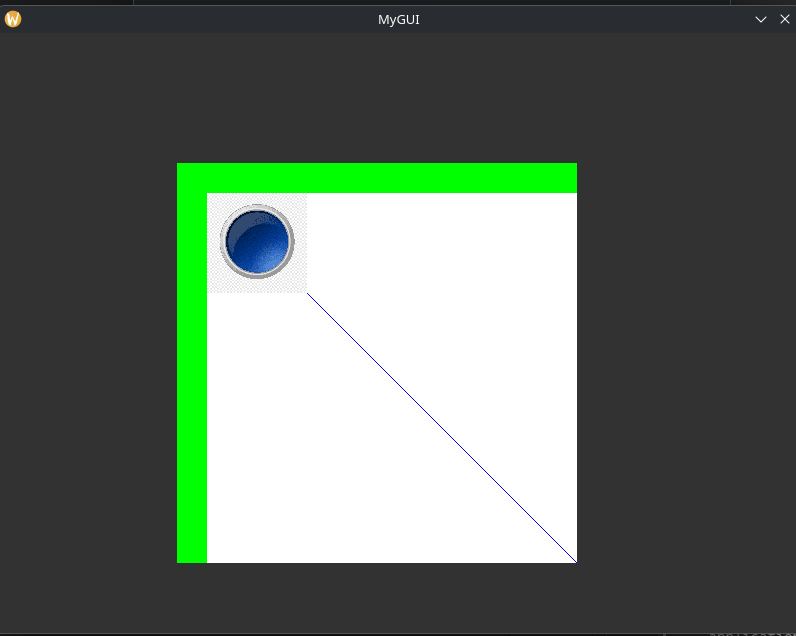

# GUI Library

A minimal **Qt-style GUI framework** built on top of **SDL2**, featuring a **widget hierarchy, window management, signal/slot system, and integration hooks for external simulation models** (e.g., Reactor). Designed for lightweight immediate-mode rendering and event-driven UIs.

---

## Features

* **SDL2-based rendering** (single window, immediate mode).
* **Hierarchical widgets** (MainWindow → Window → Widgets).
* **Z-ordered windows** with dragging and overlapping.
* **Signal/slot system** for decoupled event handling.
* **Fixed-phase main loop**: input, update, simulation, render.
* **Canvas widget** for real-time visualization (e.g., Reactor state).
* **Error-safe resource handling** with RAII or manual cleanup.

---

## Architecture

```
Application
│
├── SignalManager  (central event bus)
├── MainWindow     (top-level UI container)
│   └── Window     (draggable, Z-ordered)
│       └── Widget (Button, Canvas, etc.)
└── External model integration (e.g., Reactor)
```

**Flow**

1. **Input phase**: SDL events → Application → MainWindow → Window → Widgets.
2. **Update phase**: Widgets update state, queue commands.
3. **Simulation phase**: External model (`reactor.update()`) runs, triggers callbacks.
4. **Render phase**: Windows and Widgets render with `SDL_Render*`.

---

## Signals & Slots

* Centralized `SignalManager` manages named signals.
* Widgets **emit** signals, other components **connect** slots.
* Example:

```cpp
signalManager.connect("add_molecule", [&]() { reactor.addMolecule(); });
button.onClick = [&]() { signalManager.emit("add_molecule"); };
```

---

## Example Usage

```cpp
#include "MyGUI.h"

const int MAIN_WINDOW_WIDTH = 800;
const int MAIN_WINDOW_HEIGHT = 600;
const char MAIN_WINDOW_TITLE[] = "MyGUI";

const char PRESSED_BUTTON_IMAGE_PATH[] = "images/pressedButton.png";
const char UNPRESSED_BUTTON_IMAGE_PATH[] = "images/unpressedButton.png";

void ReactorUpdate() {
    std::cout << "Isolate Reactor has updated!\n";
}

void ReactorAddMolecule() {
    std::cout << "ReactorAddMolecule!\n";
}

int main(void) {

    MGApplication application;

    try {
        application.setMainWindow(MAIN_WINDOW_TITLE, MAIN_WINDOW_WIDTH, MAIN_WINDOW_HEIGHT);
    } catch (const std::exception& e) {
        std::cerr << "FATAL : " << e.what() << "\n";
        return -1;
    }

    SignalManager *signalManager = application.getSignalManager();
    MGMainWindow *mainWindow = application.getMainWindow();
    MGWindow *window = mainWindow->addWindow(200, 200, 400, 400);
    MGCanvas *canvas = window->addCanvas(30, 30, 1000, 1000);
    window->addCanvas(60, 60, 300, 300);
    MGButton *button = window->addButton(30, 30, 100, 100,
                               PRESSED_BUTTON_IMAGE_PATH, 
                               UNPRESSED_BUTTON_IMAGE_PATH, 
                               ReactorAddMolecule);

    application.addEventToMainLoop(ReactorUpdate);

    application.run();
    return 0;
}
```


## Picture



---

## Main Loop

```cpp
while (running) {
    processInput();
    executeTasks();   // from addToMainLoop()
    updateWidgets();
    reactor.update(); // triggers reactor.onUpdate()
    render();
}
```

---

## Requirements

* C++17 or later
* [SDL2](https://libsdl.org/)

---